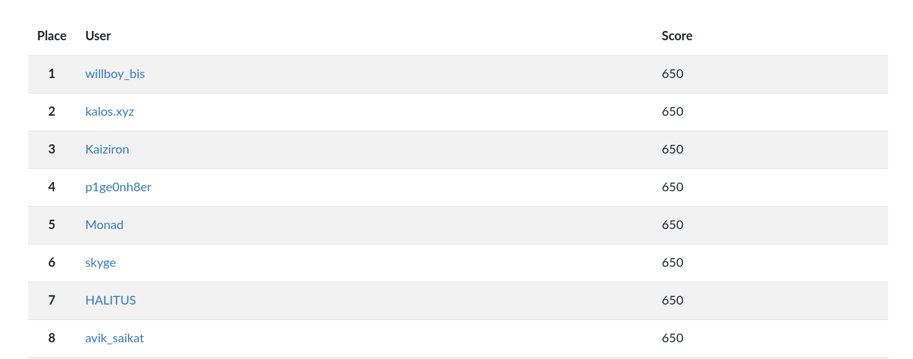

# 🔨 Mevsec CTF Solution Setup Using Brownie 🔧

# 📋 Description

A step-by-step guide to setting up a Brownie project for solving Mevsec CTF challenges, enabling you to deploy and interact with Ethereum smart contracts using Brownie framework.

CTF: https://ctf.mevsec.com/

# 📝 Prerequisites

Make sure you have the following installed before proceeding:

- Python 3.7+
- Brownie framework
- Ganache or another Ethereum development environment

# 🚀 Getting Started

1️⃣ Install Python 3.x from the official Python website: https://www.python.org/downloads/

2️⃣ Install Brownie framework using pip:

```s
pip install eth-brownie
```

3️⃣ Set up a Ganache or other Ethereum development environment for local testing and development. (Optional brownie will do it automatically just have to install & configure)

4️⃣ Create a new directory for your Mevsec CTF solution project and navigate to it in the terminal.

5️⃣ Initialize a new Brownie project using the `brownie init` command.

6️⃣ Add the smart contracts provided in the Mevsec CTF challenge to the `contracts` directory in the project.

7️⃣ Write tests for the smart contracts in the tests/ directory to verify the solutions.

8️⃣ Compile the smart contracts using the brownie compile command.

9️⃣ Deploy the smart contracts to the local development environment using the brownie run command and interact with them to solve the challenges.

# 📂 Project Structure

Your Mevsec CTF Solution project structure should look like this:

```cpp
Intro-YouTube_&_Blog_DONE/
├── contracts
│   ├── Setup.sol
│   └── VideoChalllengeIntro.sol
├── interfaces
├── reports
├── scripts
└── tests
```

# Solution

- Put the corresponding contracts in the `contracts` directory
- Get the `RPC URL`, `Private Key`, and `instance ID` like this. Depending on the challenge the number changes from 0, 1 & so on. This is an example for the first challenge.

```sh
curl '5.196.27.132:8080/create_challenge?challenge_number=0'
```

```json
{
  "message": "New instance of mevsec_ctf0 created. The RPC URL to connect to this private blockchain is  http://ctf.mevsec.com:50659. The Setup contract has been deployed at the following address: 0x876807312079af775c49c916856A2D65f904e612. If you need to deploy a contract or send a tx you can use the account 0x133756e1688E475c401d1569565e8E16E65B1337 with the private key 0xedbc6d1a8360d0c02d4063cdd0a23b55c469c90d3cfbc2c88a015f9dd92d22b3. Please don't forget you will need the following ID to flag => 662a97aa2ca4263410b6ea03cfd0fe818f44d35c9bf79bd64ac72c846218fea3. Be careful the instance will stop automatically after 20 minutes..",
  "status": "success"
}
```

- Based on the data we got add the `mevsec` RPC url to brownie config like this

```sh
brownie networks add Ethereum mevsec host=http://ctf.mevsec.com:50659 chainid=1337
```

- Run `brownie compile` to build.
- Add `brownie-config.yaml`

```yml
dotenv: .env
networks:
  default: mainnet-fork
  mevsec:
    verify: False
wallets:
  from_key: ${PRIVATE_KEY}
```

- Add `.env` file as these values are static. For all the challenge they will be same

```cpp
export PRIVATE_KEY=0xedbc6d1a8360d0c02d4063cdd0a23b55c469c90d3cfbc2c88a015f9dd92d22b3
```

- For local testing run

```py
# local testing
brownie run scripts/hack.py

# mevsec network
brownie run scripts/hack.py --network mevsec
```

# 📚 Resources

- Brownie documentation: https://eth-brownie.readthedocs.io/en/stable/
- Ganache documentation: https://www.trufflesuite.com/docs/ganache

### 🎉 Congratulations! Your Mevsec CTF Solution project is now set up with Brownie, ready for Ethereum smart contract development and solving the Mevsec CTF challenges. Happy coding! 🚀💡🔓🔍

# Current Rankings


